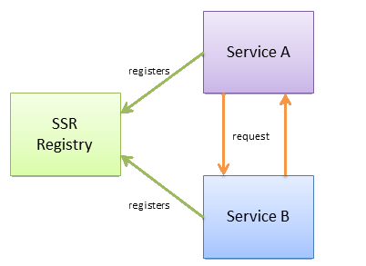

# S.S.R. (Simple Service Registry)

## What's this
A simplistic key-value that store that allows services
to register its endpoints for discovery.

## How it works ?
It's based on websockets server and client that connects to each other
in order to stabilish who's connected.

## More details
Check inside each project for more details on how to run.

## Basic diagram
