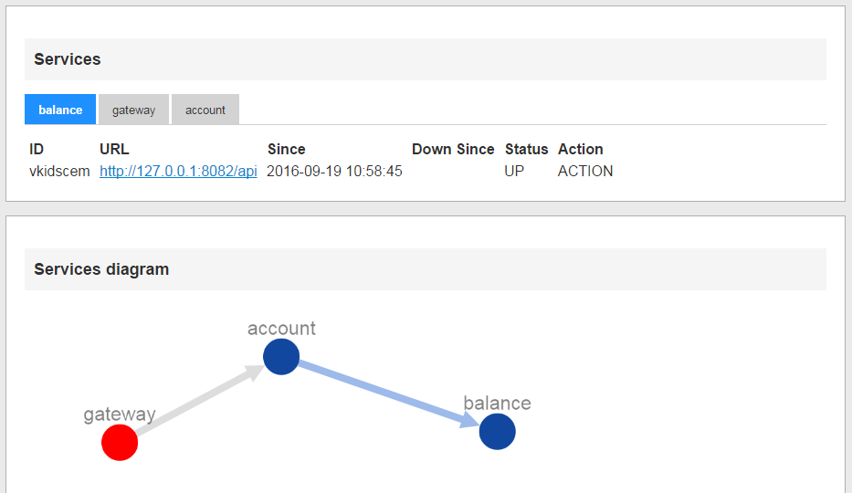

## Pre requisites
 - JDK 8.
 - Maven 3

## Implementation details
 - Runs on [Wildfly Swarm](http://wildfly-swarm.io)

## Building

    cd ssr-server
    mvn clean install

## Running

 - Running with `java -jar`

    java -jar ssr-server-swarm.jar

 - Docker

    docker build -t ssr .

Then go to http://localhost:9090

## Running on Docker
Build using the provided Dockerfile

    docker build -t registry .
    docker run -it -d -p 8080:8080 registry reg

## Change port
You can use `swarm.http.port` system properties to change the default port.
For more details about Swarm specific features, please visit Swarm webpage.

## How it works
The server is simply a websocket server backed by a map, that stores the state of each service.
It also contains REST endpoints to provide information about the connected nodes.

## Dashboard (under development)

##Rest endpoints

    /api/services
    
    [
      {
        "name": "balance",
        "instances": [
          {
            "id": "vkidscem",
            "address": "http://127.0.0.1:8082/api",
            "lastUpdate": 0,
            "since": "2016-09-19 10:58:45",
            "name": "balance",
            "state": "UP",
            "discoverable": true,
            "client": false
          }
        ],
        "links": []
      },
      {
        "name": "gateway",
        "instances": [
          {
            "id": "8qb6koxj",
            "address": "http://127.0.0.1:8080/",
            "lastUpdate": 0,
            "since": "2016-09-20 12:17:15",
            "downSince": "2016-09-20 09:23:57",
            "name": "gateway",
            "state": "DOWN",
            "discoverable": false,
            "client": true
          }
        ],
        "links": [
          "account"
        ]
      },
      {
        "name": "account",
        "instances": [
          {
            "id": "vqqnejvx",
            "address": "http://127.0.0.1:8081/api",
            "lastUpdate": 0,
            "since": "2016-09-20 12:10:47",
            "name": "account",
            "state": "UP",
            "discoverable": true,
            "client": true
          }
        ],
        "links": [
          "balance"
        ]
      }
    ]
    
##Further information
Please check [ssr-client-jee](../ssr-client-jee/README.md) for more information about the registry client for Java EE 7 system

And

[ssr-client-boot(../ssr-client-boot/README.md) for more information about the registry client for Spring services